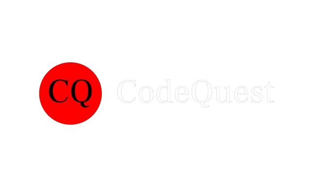

# CodeQuest: Online Coding Platform



## 🚀 Overview

**CodeQuest** is a dynamic and interactive online coding platform where users can practice Data Structures and Algorithms (DSA) questions. Built with modern web technologies, CodeQuest provides a seamless and engaging coding experience. The platform supports user authentication, problem solving, and real-time feedback, making it an ideal choice for coding enthusiasts and learners.

## ✨ Features

- **User Authentication**: Secure sign-up, login, and password reset using Firebase.
- **Interactive Home Page**: Browse and select from a list of coding problems.
- **Code Editor**: Integrated Monaco Editor for writing and testing code.
- **Real-Time Feedback**: Immediate feedback on code submissions based on predefined test cases.
- **Problem Rating**: Like, dislike, and star coding problems.
- **User Profile Management**: Update profile information and manage account settings.
- **Progress Tracking**: Track progress and view completed challenges.
- **Notifications**: Real-time notifications for activities and updates.
- **Mobile Responsive**: Optimized for both desktop and mobile use.
- **Deployment**: Seamless deployment with Vercel.

## 🛠️ Tech Stack

- **Frontend**: React, Next.js, Tailwind CSS
- **Backend**: Firebase Authentication, Firestore
- **State Management**: Recoil
- **Code Editor**: Monaco Editor
- **Notifications**: React Toastify, Firebase Cloud Messaging
- **Deployment**: Vercel


## 📥 Installation

1. Clone the repository:
    ```bash
    git clone https://github.com/your-username/CodeQuest.git
    cd CodeQuest
    ```

2. Install dependencies:
    ```bash
    npm install
    ```

3. Set up Firebase:
   - Create a Firebase project and set up Authentication and Firestore.
   - Copy the Firebase configuration to a `.env.local` file.

4. Run the development server:
    ```bash
    npm run dev
    ```

## 🚀 Getting Started

1. **Authentication Pages**: Set up and customize login, signup, and password reset pages.
2. **Home Page**: Design the home page with a list of available coding problems.
3. **Problem Details**: Create pages to display problem descriptions and integrated code editor.
4. **Real-Time Feedback**: Implement functionality to validate code submissions and display feedback.
5. **User Profile**: Develop user profile and settings management features.


## 🤝 Contributing

We welcome contributions! Please read our [Contributing Guide](CONTRIBUTING.md) to learn how you can get involved.

1. Fork the repository.
2. Create a new branch (`git checkout -b feature/your-feature`).
3. Commit your changes (`git commit -m 'Add your feature'`).
4. Push to the branch (`git push origin feature/your-feature`).
5. Create a Pull Request.

## 📜 License

This project is licensed under the MIT License. See the [LICENSE](LICENSE) file for details.

---

**CodeQuest**: Empowering coders to learn and excel in Data Structures and Algorithms.

---

